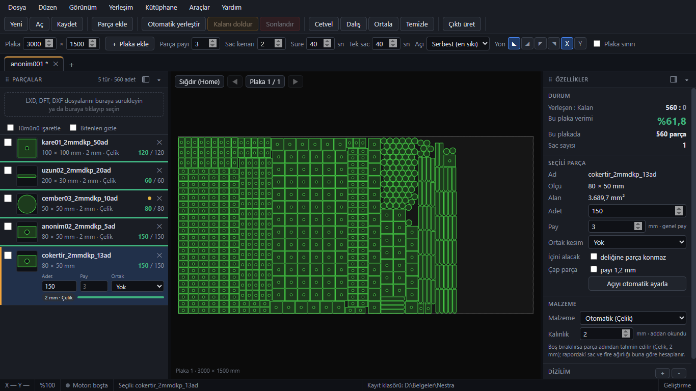
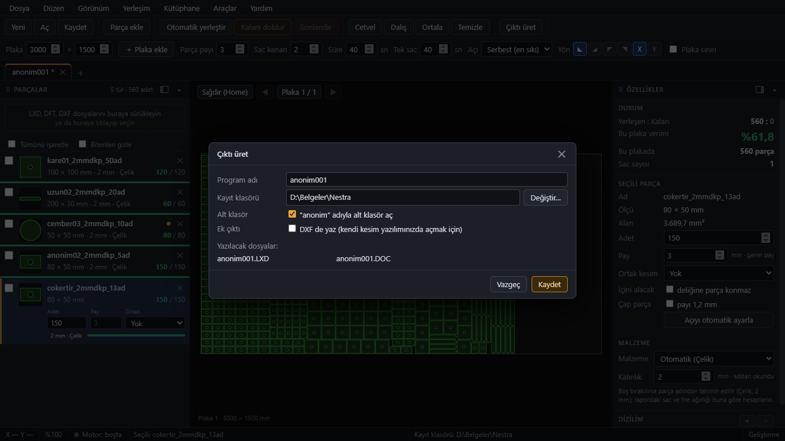
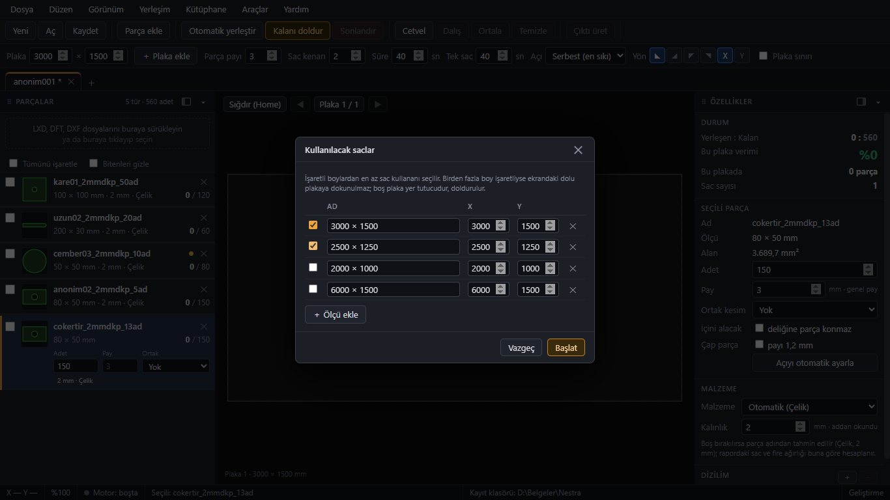
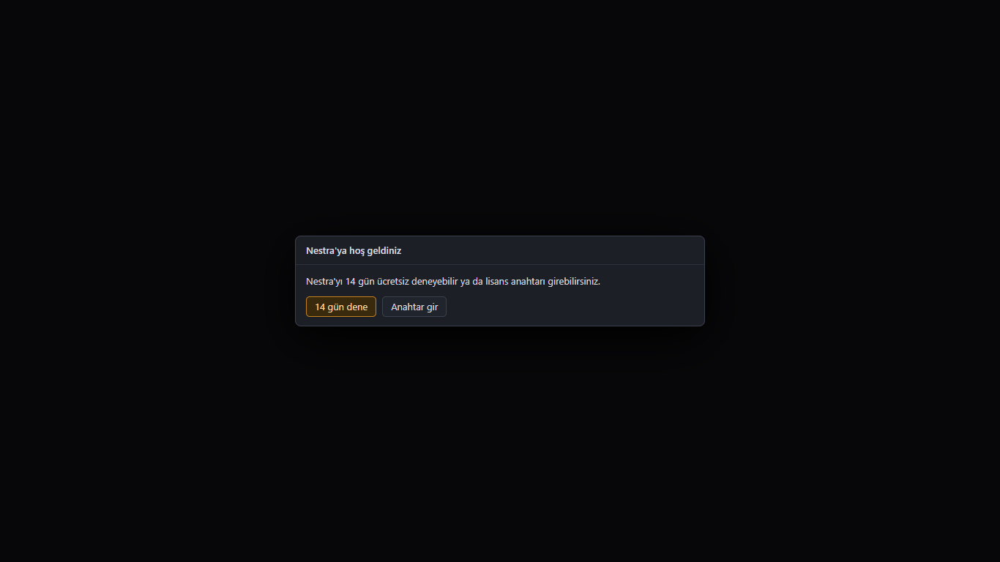

# Nestra

Lazer ve plazma kesimde parçaları sac plakaya dizen bir Windows programı. İnternet istemez, kurduğunuz bilgisayarda kendi başına çalışır.

Kesim atölyelerinin günlük işi için, genel kullanıma göre yazdık. Parçaları atıyorsunuz, plakayı seçiyorsunuz, dizilimi ekranda görüyorsunuz, istediğiniz yeri elle düzeltip çıktıyı kesim programınıza veriyorsunuz.

*3000 x 1500 plaka, beş türden 560 parça, motor 40 saniye çalıştı. Hepsi tek plakaya sığdı.*

## Nasıl kullanılıyor

LXD, DFT ya da DXF parça dosyalarını sol taraftaki alana sürükleyip bırakıyorsunuz. Her parçanın adedini, payını ve ortak kesim ayarını kartından, malzemesini ve kalınlığını sağ paneldeki özelliklerden değiştirirsiniz. Üst şeritte plaka ölçüsü, parça payı, sac kenarı ve motorun ne kadar çalışacağı var.

"Otomatik yerleştir"e basınca motor ekrandaki plakayı dizer, bitince sonucu alırsınız. Dizilimi beğenmezseniz parçayı sürükler, döndürür, kopyalar, ortak kesim verir, cetvelle ölçersiniz. Ctrl+Z çalışır.

İş bitince "Çıktı üret": her dizilim için bir LXD ve bir DOC dosyası, isterseniz DXF de yazılır. DOC'ta plakanın resmi, verimi ve kesim süresi tahmini olur. Aynı dizilimin kopyaları (örneğin 5 adet aynı sac) tek dosya takımı olarak çıkar, sac sayısı DOC'ta yazar.

## Sac boyunu siz seçersiniz, program en az harcayanı bulur

Her plakanın ölçüsü ayrı olabilir. Aynı işte biri 3000 x 1500, öbürü 2500 x 1250 olabilir, her biri kendi dosyalarıyla çıkar.

"Kalanı doldur" dediğinizde hangi sac boylarını kullanabileceğinizi işaretlersiniz. Program işaretli boyları sırayla dener, en az sac harcayanı seçer. İsterseniz sonucu almadan önce karşılaştırmaya bakarsınız. Ekranda zaten dolu bir plaka varsa ona dokunmaz, kalanı yenisine dizer.

## Başka neler var

- İş sekmeleri: Aynı anda birden fazla iş açık kalır, motor sırayla çalışır.
- `.nestra` iş dosyası: İşi kaydedip sonra aynen açarsınız. Kaydetmeden kapatırsanız program dakikada bir kurtarma kopyası alır, yeniden açınca sorar.
- Sac ve malzeme kütüphanesi: Sac ölçülerinizi ve malzeme yoğunluklarınızı bir kez girersiniz.
- Çıktıyı doğrudan kesim makinesinin okuduğu klasöre yazabilirsiniz (ayarlardan bir kez seçilir).
- Bilgisayarın ne kadarını kullanacağını ayarlayabilirsiniz (varsayılan işlemcinin %75'i).
- Bir şey ters giderse "Destek paketi oluştur": işi, günlükleri ve PC bilgisini bir zip yapar. Zip'in içine ne gireceğini önce siz görürsünüz, hiçbir yere kendiliğinden gönderilmez.

## Alıştığınız programlardan ne farkı var

Parça dosyalarını, çıktı biçimlerini ve elle düzeltme araçlarını kesim atölyelerinde alışılan şekilde bıraktık. Farklı tuttuğumuz yerler şunlar:

- Hesap yok, çalışmak için internet gerekmez. Lisans anahtarı bilgisayara bağlıdır ve internetsiz bilgisayarda da etkinleştirilir: programdaki makine kodunu bize yollarsınız, size bir anahtar veririz.
- Program iş dosyalarınızı, parçalarınızı ya da PC bilgilerinizi hiçbir yere göndermez. İnternetle yalnızca yeni sürüm var mı diye bakar (aşağıda).
- Tek kurulum dosyası, yaklaşık 100 MB. Kullanıcı hesabınıza kurulur.
- Yerleşim motorunu atölyedeki gerçek işlerle ayarladık.
- Plaka başına ayrı ölçü ve en az sac harcayan boyu seçme işi programın içinde, ek modül değil.

Bunlar kendi tercihlerimiz, hepsini herkes aynı şekilde sevmeyebilir. Önce deneyin.

## Kurulum

Son sürümü [Releases](https://github.com/webalet/nestra-surumler/releases/latest) sayfasından indirin (`Nestra-Kurulum-....exe`). Windows 10 ya da 11, 64 bit gerekir.

Kurulum dosyasını henüz dijital imzayla imzalamadık. Windows ilk çalıştırmada "bilinmeyen yayıncı" uyarısı gösterebilir: "Ek bilgi", sonra "Yine de çalıştır". Dosya ilişkilendirme sorusu çıkacak: LXD, DFT ve DXF dosyalarının çift tıklayınca Nestra'da açılmasını istiyorsanız kutuyu işaretleyin. İşaretlemezseniz bu dosyalar şimdi hangi programda açılıyorsa orada açılmaya devam eder.

İlk açılışta iki seçenek çıkar:

## Deneme ve lisans

"14 gün dene"ye basarsanız program anahtarsız 14 gün tam çalışır. Süre bitince kilitlenir ve devam etmek için anahtar ister. Açık bıraktığınız bir pencere de süre dolunca en geç birkaç dakika içinde kilitlenir, yaptığınız iş kaybolmaz, anahtarı girince kaldığınız yerden devam edersiniz.

Anahtar almak için: durum çubuğundaki "Deneme: ..." yazısına tıklayın, makine kodunu kopyalayın ve firma adınızla birlikte darkhesaplar@gmail.com adresine yollayın. Makine kodu gizli bir bilgi değildir, anahtar yalnızca o bilgisayarda çalışır. Anahtar süresiz ya da bitiş tarihli verilebilir.

## Güncelleme

İnternet varsa program açılışta bu sayfadaki son sürüme bakar. Yeni sürüm varsa durum çubuğunda "Güncelle" düğmesi çıkar. Basınca indirir, bütünlüğünü ve imzamızı doğrular, programı kapatıp kurar, yeniden açar. Kaydedilmemiş işiniz varsa önce kaydetmenizi ister. İnternetsiz bilgisayarlarda hiçbir şey olmaz, kurulum dosyasını USB ile götürüp eskisinin üstüne kurmanız yeter, ayarlarınız ve işleriniz kalır.

## Bilinen sınırlar

- DXF dosyalarında çizgi, yay, daire ve LWPOLYLINE okunur. SPLINE, ELLIPSE, blok (INSERT) ve eski tip POLYLINE şimdilik okunmaz, bunlar sessizce atlanır. DXF'inizde bunlar varsa parça eksik gelebilir; yerleştirmeden önce soldaki parça kartındaki şekle bakın. Başka bir programdan gelen DXF'te ilk takılacağınız yer büyük ihtimalle burası.
- Kesim yazılımınızın bizim LXD ve DOC dosyalarını açtığını ilk işte kendiniz kontrol edin. Kendi dosyalarınızla denemeden canlı işe vermeyin.
- Windows 7 ve 8 desteklenmez.
- Programın içinde "Hakkında" penceresinde sürüm, motor sürümü ve lisans durumu görünür; destek isterken bunları yazın.

## Soru ve hata bildirimi

Program şu an geliştirme aşamasında. Soru, hata ve lisans isteği için darkhesaplar@gmail.com adresine yazın. Hata bildirirken mümkünse Yardım menüsündeki "Destek paketi oluştur" ile aldığınız zip'i ekleyin.
